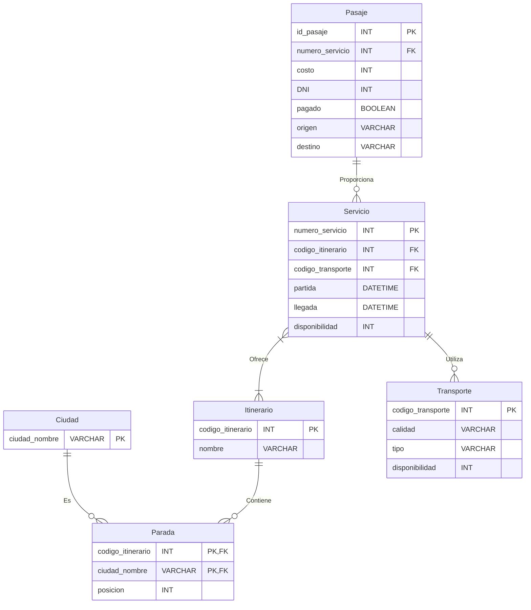

# Viaja Plus
## Sistema de Reserva de Pasajes

Mira este video para obtener una demostración del proyecto en acción:


### Descripción General:
Este proyecto fue desarrollado como el proyecto final para la materia "Diseño y Administración de Bases de Datos". La tarea consistió en la creación de una aplicación de reserva de pasajes desde cero, incluyendo el diseño y la implementación del esquema de la base de datos, así como el desarrollo de una interfaz visual para su utilización.

### Objetivo:
El objetivo principal del proyecto era aplicar los conocimientos adquiridos en la materia sobre diseño y administración de bases de datos.

### Funcionalidades Principales:
1. **Gestión de Ciudad**: Permite administrar las ciudades disponibles para viajar.
2. **Gestión de Itinerarios**: Permite definir y administrar los itinerarios de viaje.
3. **Gestión de Paradas**: Permite gestionar las paradas dentro de un itinerario.
4. **Reserva de Pasajes**: Permite a los usuarios reservar pasajes para viajar entre ciudades.
5. **Gestión de Servicios**: Permite definir y administrar los servicios de transporte disponibles.
6. **Gestión de Transporte**: Permite administrar los diferentes medios de transporte disponibles.

### Tecnologías Utilizadas:
- **Backend**:
  - Django
  - Python
  - MySQL

- **Frontend**:
  - HTML
  - CSS
  - JavaScript
  - Bootstrap

### Instalación del Proyecto en Local

Sigue estos pasos para instalar y ejecutar el proyecto en tu entorno local:

1. **Clonar el Repositorio:**
   Clona el repositorio del proyecto desde el siguiente enlace: [Enlace al Repositorio](https://github.com/joseialegre/ViajaPlus).

2. **Configurar el Entorno Virtual (Opcional):**
   Se recomienda crear un entorno virtual para el proyecto. Utiliza la herramienta `virtualenv` para crear un nuevo entorno virtual en la raíz del proyecto:

   ```bash
   python -m venv venv
   ```

   Luego, activa el entorno virtual:

   ```bash
   source venv/bin/activate  # En sistemas Unix
   venv\Scripts\activate     # En sistemas Windows
   ```

3. **Instalar Dependencias:**
   Instala las dependencias del proyecto utilizando `pip`, el gestor de paquetes de Python:

   ```bash
   pip install -r requirements.txt
   ```

4. **Crear un Superusuario (Opcional):**
   Si deseas acceder al panel de administración de Django, crea un superusuario con el siguiente comando y sigue las instrucciones:

   ```bash
   python manage.py createsuperuser
   ```

6. **Ejecutar el Servidor:**
   Finalmente, ejecuta el servidor de desarrollo de Django:

   ```bash
   python manage.py runserver
   ```

   El proyecto estará disponible en la dirección [http://127.0.0.1:8000/](http://127.0.0.1:8000/).

### Diagrama Entidad Relación
