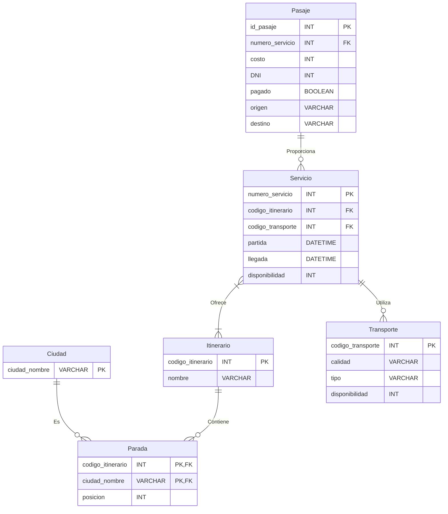

# Viaja Plus
## Sistema de Reserva de Pasajes

### Descripción General:
Este proyecto fue desarrollado como el proyecto final para la materia "Diseño y Administración de Bases de Datos". La tarea consistió en la creación de una aplicación de reserva de pasajes desde cero, incluyendo el diseño y la implementación del esquema de la base de datos, así como el desarrollo de una interfaz visual para su utilización.

### Objetivo:
El objetivo principal del proyecto era aplicar los conocimientos adquiridos en la materia sobre diseño y administración de bases de datos.

### Funcionalidades Principales:
1. **Gestión de Ciudad**: Permite administrar las ciudades disponibles para viajar.
2. **Gestión de Itinerarios**: Permite definir y administrar los itinerarios de viaje.
3. **Gestión de Paradas**: Permite gestionar las paradas dentro de un itinerario.
4. **Reserva de Pasajes**: Permite a los usuarios reservar pasajes para viajar entre ciudades.
5. **Gestión de Servicios**: Permite definir y administrar los servicios de transporte disponibles.
6. **Gestión de Transporte**: Permite administrar los diferentes medios de transporte disponibles.

### Tecnologías Utilizadas:
- **Backend**:
  - Django
  - Python
  - MySQL

- **Frontend**:
  - HTML
  - CSS
  - JavaScript
  - Bootstrap

### Consideraciones Finales:
Este proyecto representa un ejercicio completo de diseño, implementación y despliegue de una aplicación web de reserva de pasajes. Sirve como prueba de los conocimientos adquiridos en la materia y demuestra la capacidad para desarrollar soluciones completas y funcionales utilizando las tecnologías mencionadas.

### Diagrama Entidad Relación
